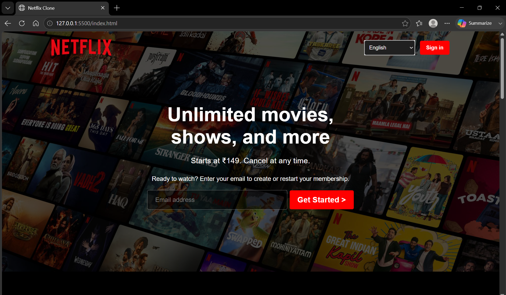

# 🎬 Netflix UI Clone

A Netflix inspired UI clone built using **HTML and CSS**.  
This project recreates the Netflix homepage interface with a hero section, movie/show cards, and a responsive layout.


## 📸 Preview




## ✨ Features

- Netflix style homepage design
- Hero banner section with background image
- Movie/show cards layout
- Horizontal scrolling movie sections
- Responsive design
- Custom CSS styling
- Local images and assets integration


## 🛠️ Technologies Used

- HTML5
- CSS3
- Flexbox
- Responsive Web Design


## 📂 Project Structure

```
NETFLIX-UI-CLONE

│
├── Assets
│
├── index.html
│
└── style.css
```


## ▶️ How to Run

1. Clone the repository

```bash
git clone https://github.com/ravishukla27/Netflix-UI-Clone.git
```

2. Open the project folder

3. Open `index.html` in your browser


## 🎯 Purpose

This project was created to practice frontend development concepts:

- HTML structure
- CSS layouts
- Flexbox positioning
- Background images
- Responsive design
- UI cloning


## 👨‍💻 Author

**Ravi Shukla**

GitHub:
https://github.com/ravishukla27


⭐ If you like this project, consider giving it a star!
